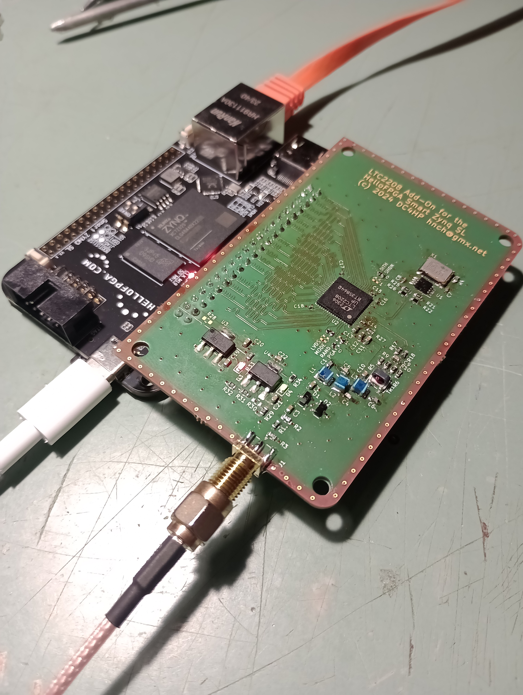
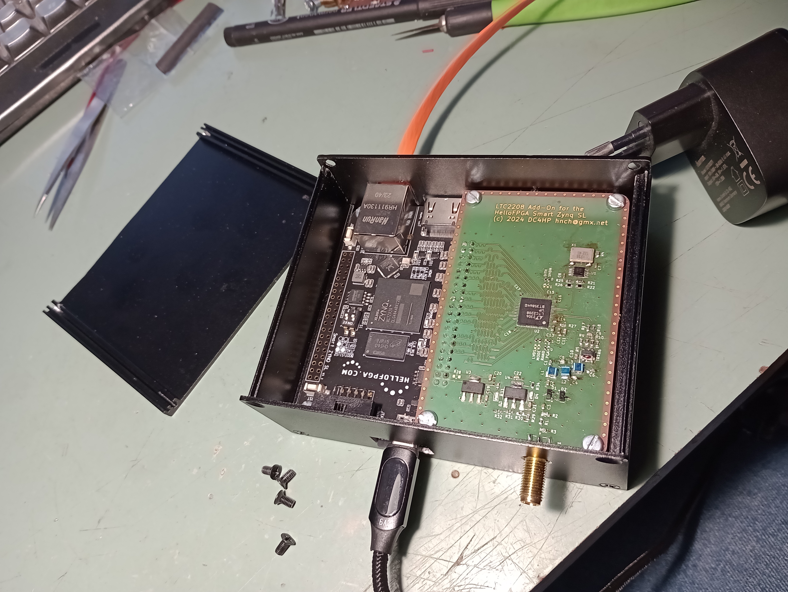
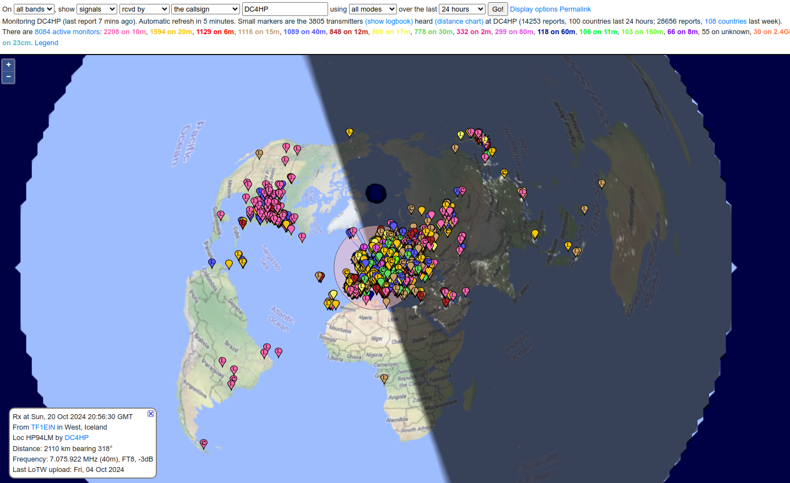

# smartzynq-adc-addon
KiCad files for the SmartZynq ADC addon board

*Make sure to reconfigure VCCIO on the SmartZynq to 2.5V!*

Licensed under CERN-OHL-W v2

## Hardware build

This board is supposed to be mounted on a HelloFPGA Smart Zynq SL FPGA board such as the one that can be purchased [here](https://aliexpress.com/item/1005006384235496.html).

It can be nicely mounted in an enclosure such as [this one](https://aliexpress.com/item/1005007125132369.html):

## Receive performance

The receive performance of the [sdr_receiver_ft8_122_88 project](https://github.com/hennichodernich/hellofpga-smartzynq-notes/tree/main/projects/sdr_receiver_ft8_122_88) is really good (on 22m EFHW):

